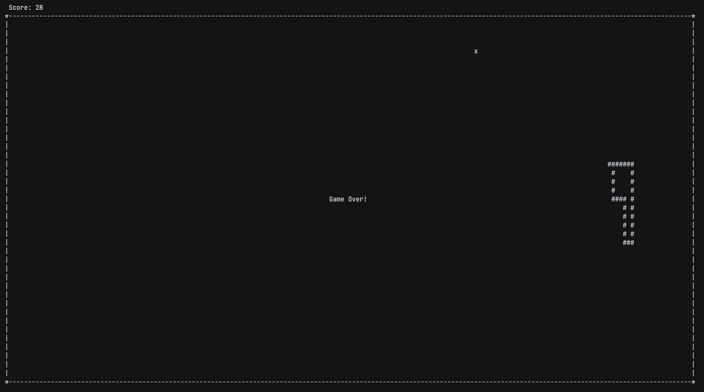

# SNAKE GAME

El juego clásico del snake hecho en ncurses.




## DEPENDENCIAS
- Ncurses
- Compilador que admita C++14
- Cmake
- Make, Ninja... (cualquiera que cmake soporte)

## COMPILACIÓN
```sh
$ cmake -B build -DCMAKE_BUILD_TYPE=Release -B build
$ cmake --build build
```

> El binario se generará en `./bin/snake`.

